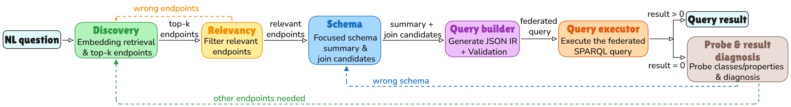

# Agentic-FedSPARQL

[](#requirements)
[](#how-it-works)
[](#dataset)
[](LICENSE)

Agentic-FedSPARQL is a research pipeline for natural-language question answering over federated RDF graphs. Given a question, it discovers relevant SPARQL endpoints, extracts compact schema evidence, plans a structured query representation, compiles it into federated SPARQL, executes the query, and uses validation feedback to retry the right stage when something goes wrong.

The project is built around the SPIDER4FedSPARQL benchmark: a sharded, federated version of SPIDER4SPARQL with local Apache Jena Fuseki endpoints and `SERVICE`-based gold queries.

## Highlights

- Hybrid endpoint discovery with dense embeddings, BM25, reciprocal rank fusion, and LLM reranking.
- Schema-aware query planning through DSPy modules and explicit JSON IR validation.
- Federated SPARQL generation using endpoint-local graph patterns wrapped in `SERVICE` clauses.
- Runtime validation with empty-result diagnosis, endpoint blacklisting, and targeted retries.

## How It Works



| Stage | Code | Role |
| --- | --- | --- |
| Discovery | `src/modules/discovery.py` | Expands the question, ranks endpoints with dense and lexical retrieval, then asks an LLM to select sufficient candidates. |
| Schema | `src/modules/schema.py` | Queries endpoint VoID-style descriptions and filters them into a compact schema summary plus join candidates. |
| Query Builder | `src/modules/query_builder.py` | Produces a JSON query IR, validates it, and compiles it to federated SPARQL. |
| Validator | `src/modules/validator.py` | Executes the query, accepts non-empty results, or diagnoses whether discovery, schema, or query generation should be retried. |
| Evaluation | `src/evaluate.py` | Runs benchmark examples, stores predictions and gold references, and computes discovery and answer metrics. |

## Repository Layout

```text
.
|-- src/
|   |-- main.py                         # single, benchmark, and baseline entry point
|   |-- pipeline.py                     # end-to-end agentic FedSPARQL pipeline
|   |-- baseline_pipeline.py            # discovery + zero-shot SPARQL baseline
|   |-- modules/                        # discovery, schema, query builder, validator
|   |-- evaluate.py                     # benchmark runner
|   |-- metrics.py                      # execution, precision, recall, F1, discovery metrics
|   |-- search_pipeline_hyperparameters.py
|   |-- ablate_discovery.py
|   |-- summarize_benchmarks.py
|   `-- recalculate_discovery_metrics.py
|-- data/
|   |-- SPIDER4FedSPARQL/               # benchmark data and dataset documentation
|   |-- benchmark_results/              # stored benchmark outputs
|   `-- hyperparameters_search/         # search protocols, checkpoints, and run artifacts
|-- requirements.txt
`-- LICENSE
```

## Requirements

- Python 3.11 or newer.
- A local SPARQL backend, typically Apache Jena Fuseki, exposing the benchmark shards at URLs like `http://host.docker.internal:3030/<endpoint_name>/sparql`.
- An LLM provider reachable through DSPy/LiteLLM, or a local Ollama model.
- Enough disk/network access for the first `sentence-transformers` embedding model download.

The default federated executor in `src/sparql_utils.py` is:

```text
http://host.docker.internal:3030/fkgqa_federation/sparql
```

The dataset README has the most detailed notes on local endpoint layout and shard loading: [`data/SPIDER4FedSPARQL/README.md`](data/SPIDER4FedSPARQL/README.md).

## Quick Start

```bash
git clone <repo-url>
cd Agentic-FedSPARQL

python3 -m venv .venv
source .venv/bin/activate
pip install -r requirements.txt
```

Create a local environment file, for example `src/.env`, with the provider settings you need:

```bash
# General
MODE=benchmark
LLM_MODEL=lightning-ai/gemma-4-31B-it
MAX_RETRIES=9
BATCH_SIZE=20

# Lightning/OpenAI-compatible endpoint
LIGHTNING_API_KEY=...
LIGHTNING_API_ENDPOINT=...
LIGHTNING_REQUEST_DELAY_SECONDS=2
LIGHTNING_LM_RETRIES=5

# Optional alternatives
# OLLAMA_MODEL=llama3.1
# OLLAMA_API_BASE=http://host.docker.internal:11434
# DEEPSEEK_API_KEY=...
# AZURE_OPENAI_API_KEY=...
# AZURE_OPENAI_ENDPOINT=...
# AZURE_OPENAI_API_VERSION=2024-02-01
```

Run a single example:

```bash
MODE=single python3 src/main.py
```

Run the full agentic benchmark:

```bash
MODE=benchmark \
BENCHMARK_DATA_PATH=data/SPIDER4FedSPARQL/class-sharding/SPIDER4FedSPARQL_benchmark.json \
python3 src/main.py
```

Run the baseline:

```bash
MODE=baseline python3 src/main.py
```

Results are written under `data/benchmark_results/<model>/` by default, with the active configuration saved alongside the result rows.

## Configuration

Most runtime behavior is controlled in [`src/config.py`](src/config.py).

| Variable | Default | Description |
| --- | --- | --- |
| `MODE` | `benchmark` | `single`, `benchmark`, or `baseline`. |
| `LLM_MODEL` | `lightning-ai/gemma-4-31B-it` | Model identifier passed to DSPy/LiteLLM. |
| `OLLAMA_MODEL` | unset | Convenience shortcut for local Ollama models. |
| `BENCHMARK_DATA_PATH` | class-sharding benchmark JSON | Dataset file for evaluation. |
| `BENCHMARK_RESULT_PATH` | model-specific JSON under `data/benchmark_results/` | Output path for benchmark predictions and metrics. |
| `MAX_RETRIES` | `9` | Maximum outer refinement attempts. |
| `DISCOVERY_RETRY_LIMIT` | `6` | Discovery batch/retry limit. |
| `QUERY_BUILDER_RETRIES` | `6` | Internal retries for JSON IR/query planning. |
| `SCHEMA_SUMMARY_RETRY_LIMIT` | `9` | Retries for valid schema-summary JSON. |
| `BATCH_SIZE` | `20` | Number of endpoints evaluated per discovery batch. |

## Dataset

The primary benchmark lives in:

```text
data/SPIDER4FedSPARQL/class-sharding/
```

It includes:

| File | Purpose |
| --- | --- |
| `SPIDER4FedSPARQL_benchmark.json` | Full train + dev benchmark. |
| `SPIDER4FedSPARQL_train.json` | Training split. |
| `SPIDER4FedSPARQL_dev.json` | Development split. |
| `endpoints_metadata.json` | Retrieval and schema metadata used by discovery. |
| `shard_endpoints.json` | Mapping from shards to local Fuseki endpoint URLs. |

The class-sharding snapshot contains 2,229 benchmark examples and 661 class-shard endpoint records. Evaluation filters to examples whose validation is marked valid and whose original query produced at least one answer.

## Experiment Utilities

Summarize benchmark outputs:

```bash
python3 src/summarize_benchmarks.py
```

Run a reproducible full-pipeline hyperparameter search:

```bash
python3 src/search_pipeline_hyperparameters.py \
  --split dev \
  --limit 100 \
  --search-method random \
  --max-configs 50 \
  --output-dir data/hyperparameters_search/pipeline_search_random_50
```

Evaluate only discovery:

```bash
python3 src/ablate_discovery.py \
  --split dev \
  --limit 100 \
  --batch-size 100 \
  --discovery-retry-limit 3
```

Rank discovery search results:

```bash
python3 src/analyze_discovery_hyperparameters.py \
  data/hyperparameters_search/discovery_agent/discovery_random_50.csv
```

Recalculate discovery metrics from `SERVICE` clauses in gold queries:

```bash
python3 src/recalculate_discovery_metrics.py \
  --input data/benchmark_results/<provider>/<model>/benchmark_result_9_retries.json \
  --keep-original-gold
```

## Outputs

Benchmark result files are JSON envelopes:

```json
{
  "config": {
    "llm_model": "lightning-ai/gemma-4-31B-it",
    "max_retries": 9,
    "batch_size": 20
  },
  "results": [
    {
      "question": "...",
      "predicted_endpoints": ["..."],
      "gold_endpoints": ["..."],
      "predicted_sparql": "...",
      "gold_sparql": "...",
      "execution_accuracy": 1.0,
      "precision": 1.0,
      "recall": 1.0,
      "f1_score": 1.0,
      "refinement_attempts": 0
    }
  ]
}
```

The evaluator saves after every question and skips already processed questions when the same output path is reused.

## Notes and Caveats

- Endpoint URLs are local development URLs. If your Fuseki instance does not use `host.docker.internal:3030`, rewrite the dataset URLs or adjust the code before running benchmarks.
- `src/sparql_utils.py` currently uses a hard-coded federated executor endpoint. Keep it aligned with your local Fuseki dataset name.
- The first discovery run may take longer while `sentence-transformers` downloads and initializes `nomic-ai/nomic-embed-text-v1.5`.
- Long benchmark runs can be expensive because each question may invoke discovery, schema filtering, query planning, validation, and retries.

## License

Code in this repository is released under the [MIT License](LICENSE). Dataset usage is governed by the provenance and license information associated with SPIDER4FedSPARQL and its upstream SPIDER4SPARQL source.
